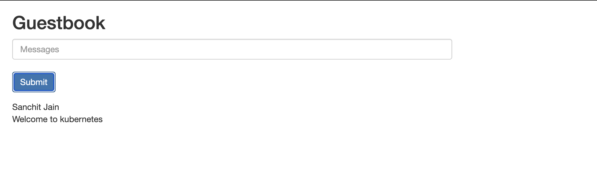

### Introduction to Amazon Elastic Kubernetes Service 

1. What is Amazon EKS?
   - Amazon EKS (Elastic Container Service for Kubernetes) is a managed Kubernetes service that allows you to run Kubernetes on AWS without the hassle of managing the Kubernetes control plane. The Kubernetes control plane plays a crucial role in a Kubernetes deployment as it is responsible for how Kubernetes communicates with your cluster
   - The big benefit of EKS, and other similar hosted Kubernetes services, is taking away the operational burden involved in running this control plane. You deploy cluster worker nodes using defined AMIs and with the help of CloudFormation, and EKS will provision, scale and manage the Kubernetes control plane for you to ensure high availability, security and scalability. 
   
 2. Deployment of Amazon EKS

- **Prerequisite: Before you start**
    You will need to make sure you have the following components installed and set up before you start with Amazon EKS:
   - AWS CLI – while you can use the AWS Console to create a cluster in EKS, the AWS CLI is easier. You will need version 1.16.73 at least. For further instructions, <a href="https://docs.aws.amazon.com/cli/latest/userguide/cli-chap-install.html">click here</a>.
   - Kubectl – used for communicating with the cluster API server. For further instructions on installing, click here. This endpoint is public by default, but is secured by proper configuration of a VPC (see below).
   - AWS-IAM-Authenticator – to allow IAM authentication with the Kubernetes cluster. Check out the repo on GitHub for instructions on setting this up.
 
- **Step 1: Creating an EKS role**
   Our first step is to set up a new IAM role with EKS permissions.
  - Open the IAM console, select Roles on the left and then click the Create Role button at the top of the page.
  - From the list of AWS services, select EKS and then Next: Permissions at the bottom of the page.
      
  - Leave the selected policies as-is, and proceed to the Review page
      
  - Enter a name for the role (e.g. eksrole) and hit the Create role button at the bottom of the page to create the IAM role.

  - The IAM role is created.
    
  - Be sure to note the Role ARN, you will need it when creating the Kubernetes cluster in the steps below.
  
  - Amazon EKS also offers service account IAM roles, eliminating previous iterations’ requirement for extended worker node permissions.
 
- **Step 2: Creating a VPC for EKS**
   Next, we’re going to create a separate VPC a Virtual Private Cloud that protects communication between worker nodes and the AWS Kubernetes and API server for our EKS cluster. To do this, we’re going to use a CloudFormation template that contains all the necessary EKS-specific ingredients for setting up the VPC.
   - Open up CloudFormation, and click the Create new stack button.
   - On the Select template page, enter the URL of the CloudFormation YAML in the relevant section <a href="https://amazon-eks.s3-us-west-2.amazonaws.com/cloudformation/2019-01-09/amazon-eks-vpc-sample.yaml">url</a> 
      
   - Click Next.
      
   - Give the VPC a name, leave the default network configurations as-is, and click Next.

   - On the Options page, you can leave the default options untouched and then click Next.
   
   - On the Review page, simply hit the Create button to create the VPC.

   - CloudFormation will begin to create the VPC. Once done, be sure to note the various values created — SecurityGroups, VpcId and SubnetIds. You will need these in subsequent steps. You can see these under the Outputs tab of the CloudFormation stack:

   - As of December 2019, you can configure the private access point of the API server from outside of the VPC.

   - Ensure you have set to true the enableDnsHostnames and enableDnsSupport fields, otherwise routing to the API server won’t work.
 
- **Step 3: Creating the EKS cluster**
   As mentioned above, we will use the AWS CLI to create the Kubernetes cluster. To do this, use the following command:
       
       aws eks --region region create-cluster --name clusterName --role-arn EKS-role-ARN --resources-vpc-config subnetIds=subnet-id-1,subnet-id-2,subnet-id-3,securityGroupIds=security-group-id
  
   - Be sure to replace the bracketed parameters as follows:
  1. region — the region in which you wish to deploy the cluster.
  2. clusterName — a name for the EKS cluster you want to create.
  3. EKS-role-ARN — the ARN of the IAM role you created in the first step above.
  4. subnetIds — a comma-separated list of the SubnetIds values from the AWS CloudFormation output that you generated in the previous step.
  5. security-group-id — the SecurityGroups value from the AWS CloudFormation output that you generated in the previous step.

   - Executing this command, you should see the following output in your terminal:
   
          {
              "cluster": {
                  "status": "CREATING",
                  "name": "demo",
                  "certificateAuthority": {},
                  "roleArn": "arn:aws:iam::account-id:role/eksServiceRole",
                  "resourcesVpcConfig": {
                      "subnetIds": [
                          "subnet-id-1",
                          "subnet-id-2",
                          "subnet-id-3"
                      ],
                      "vpcId": "vpc-id",
                      "securityGroupIds": [
                          "security-group-id"
                      ]
                  },
                  "version": "1.11",
                    "arn": "arn:aws:eks:us-east-1:account-id:cluster/demo",
                  "platformVersion": "eks.1",
                  "createdAt": 1550401288.382
              }
          }
      
   - It takes about 5 minutes before your cluster is created. You can ping the status of the command using this CLI command:
   
          aws eks --region us-east-1 describe-cluster --name demo --query cluster.status
    
   - The output displayed will be: "CREATING"
   
   - Or you can open the Clusters page in the EKS Console:
   
   - Once the status changes to “ACTIVE”, we can proceed with updating our kubeconfig file with the information on the new cluster so kubectl can communicate with it.

   - To do this, we will use the AWS CLI update-kubeconfig command (be sure to replace the region and cluster name to fit your configurations):
     
          aws eks --region us-east-1 update-kubeconfig --name demo

   - You should see the following output:  
   
          Added new context arn:aws:eks:us-east-1:account-id:cluster/demo to /Users/Sanchit/.kube/config
     
   - We can now test our configurations using the kubectl get svc command:
     
          kubectl get svc
          
        <table>
             <tr>
             <td>NAME</td>
             <td>TYPE</td>
             <td>CLUSTER-IP</td>
             <td>EXTERNAL-IP</td>
             <td>PORT(S)</td>
             <td>AGE</td>
             </tr>
             <tr>
             <td>kubernetes</td>
             <td>ClusterIP</td>
             <td>10.100.0.1</td>
             <td>none</td>
             <td>443/TCP</td>
             <td>2m</td>
             </tr>  
        </table>
        
   - Click the cluster in the EKS Console to review configurations:
 
- **Step 4: Launching Kubernetes worker nodes**
   Now that we’ve set up our cluster and VPC networking, we can now launch Kubernetes worker nodes. To do this, we will again use a CloudFormation template.
   
   - Open CloudFormation, click Create Stack, and this time use the following template URL: <a href="https://amazon-eks.s3-us-west-2.amazonaws.com/cloudformation/2019-01-09/amazon-eks-nodegroup.yaml">url</a> 

   - Clicking Next, name your stack, and in the EKS Cluster section enter the following details:
  1. ClusterName – the name of your Kubernetes cluster (e.g. demo)
  2. ClusterControlPlaneSecurityGroup – the same security group you used for creating the cluster in previous step.
  3. NodeGroupName – a name for your node group.
  4. NodeAutoScalingGroupMinSize – leave as-is. The minimum number of nodes that your worker node Auto Scaling group can scale to.
  5. NodeAutoScalingGroupDesiredCapacity – leave as-is. The desired number of nodes to scale to when your stack is created.
  6. NodeAutoScalingGroupMaxSize – leave as-is. The maximum number of nodes that your worker node Auto Scaling group can scale out to.
  7. NodeInstanceType – leave as-is. The instance type used for the worker nodes.
  8. NodeImageId – the Amazon EKS worker node AMI ID for the region you’re using. For us-east-1, for example: ami-0c5b63ec54dd3fc38
  9. KeyName – the name of an Amazon EC2 SSH key pair for connecting with the worker nodes once they launch.
  10. BootstrapArguments – leave empty. This field can be used to pass optional arguments to the worker nodes bootstrap script.
  11. VpcId – enter the ID of the VPC you created in Step 2 above.
  12. Subnets – select the three subnets you created in Step 2 above.

  - Proceed to the Review page, select the check-box at the bottom of the page acknowledging that the stack might create IAM resources, and click Create.
  
  - CloudFormation creates the worker nodes with the VPC settings we entered — three new EC2 instances are created using the
  
  - As before, once the stack is created, open Outputs tab:

  - Note the value for NodeInstanceRole as you will need it for the next step — allowing the worker nodes to join our Kubernetes cluster.

  - To do this, first download the AWS authenticator configuration map:
      curl -O https://amazon-eks.s3-us-west-2.amazonaws.com/cloudformation/2019-01-09/aws-auth-cm.yaml

  - Open the file and replace the rolearn with the ARN of the NodeInstanceRole created above:
      
        apiVersion: v1
        kind: ConfigMap
        metadata:
          name: aws-auth
          namespace: kube-system
        data:
          mapRoles: |
            - rolearn: <ARN of instance role>
              username: system:node:{{EC2PrivateDNSName}}
              groups:
                - system:bootstrappers
                - system:nodes

  - Save the file and apply the configuration: kubectl apply -f aws-auth-cm.yaml
  
  - You should see the following output: configmap/aws-auth created
  
  - Use kubectl to check on the status of your worker nodes: kubectl get nodes --watch
 
- **Step 5: Installing a demo app on Kubernetes**

  - Congrats! Your Kubernetes cluster is created and set up. To take her for a spin, we’re going to deploy a simple Guestbook app written in PHP and using Redis for storing guest entries.
  
  - The following commands create the different Kubernetes building blocks required to run the app — the Redis master replication controller, the Redis master service, the Redis slave replication controller, the Redis slave service, the Guestbook replication controller and the guestbook service itself:
  
        kubectl apply -f https://raw.githubusercontent.com/kubernetes/examples/master/guestbook-go/redis-master-controller.json

        kubectl apply -f https://raw.githubusercontent.com/kubernetes/examples/master/guestbook-go/redis-master-service.json

        kubectl apply -f https://raw.githubusercontent.com/kubernetes/examples/master/guestbook-go/redis-slave-controller.json

        kubectl apply -f https://raw.githubusercontent.com/kubernetes/examples/master/guestbook-go/redis-slave-service.json

        kubectl apply -f https://raw.githubusercontent.com/kubernetes/examples/master/guestbook-go/guestbook-controller.json

        kubectl apply -f https://raw.githubusercontent.com/kubernetes/examples/master/guestbook-go/guestbook-service.json 
  
  - Use kubectl to see a list of your services: 
  
        kubectl get svc
        
       <table>
             <tr>
             <td>NAME</td>
             <td>TYPE</td>
             <td>CLUSTER-IP</td>
             <td>EXTERNAL-IP</td>
             <td>PORT(S)</td>
             <td>AGE</td>
             </tr>
             <tr>
             <td>guestbook</td>
             <td>LoadBalancer</td>
             <td>10.100.17.29</td>
             <td>aeeb4ae3132ac11e99a8d12b26742fff-1272962453.us-west-2.elb.amazonaws.com</td>
             <td>3000:31747/TCP</td>
             <td>7m</td>
             </tr>  
             <tr>
             <td>kubernetes</td>
             <td>ClusterIP</td>
             <td>10.100.0.1</td>
             <td>none</td>
             <td>443/TCP</td>
             <td>2m</td>
             </tr>  
             <tr>
             <td>redis-master</td>
             <td>ClusterIP</td>
             <td>10.100.224.82</td>
             <td>none</td>
             <td>6379/TCP</td>
             <td>8m</td>
             </tr>  
             <tr>
             <td>redis-slave</td>
             <td>ClusterIP</td>
             <td>10.100.150.193</td>
             <td>none</td>
             <td>6379/TCP</td>
             <td>8m</td>
             </tr>  
        </table>

  - Open your browser and point to the guestbook’s external IP at port 3000:
  
       
